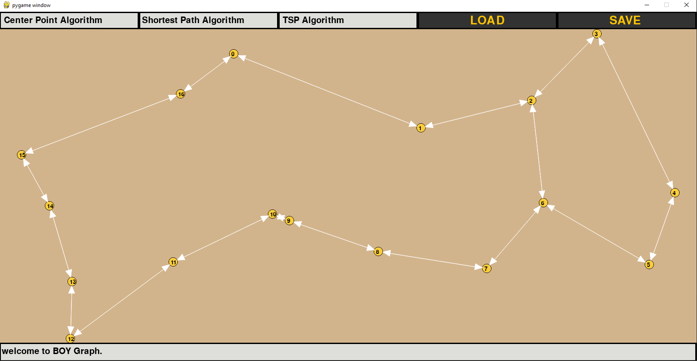
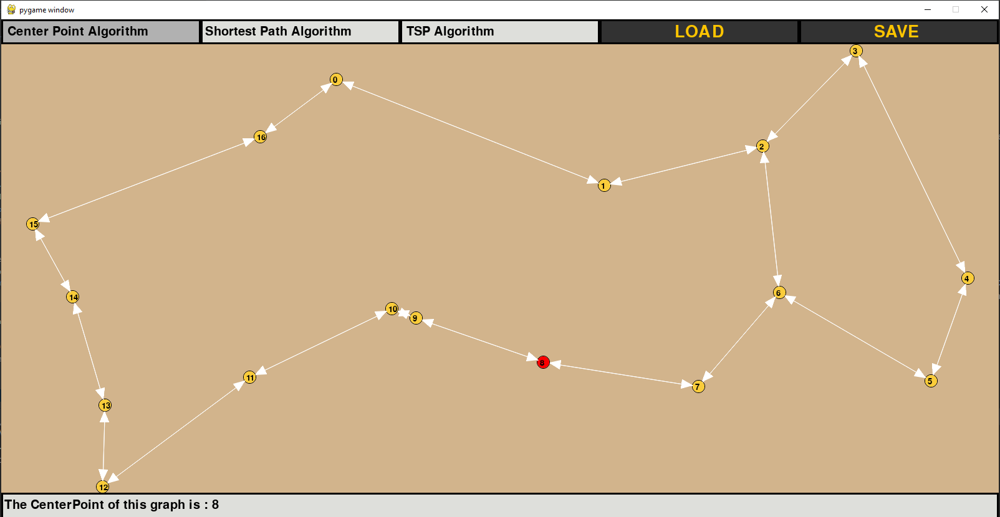
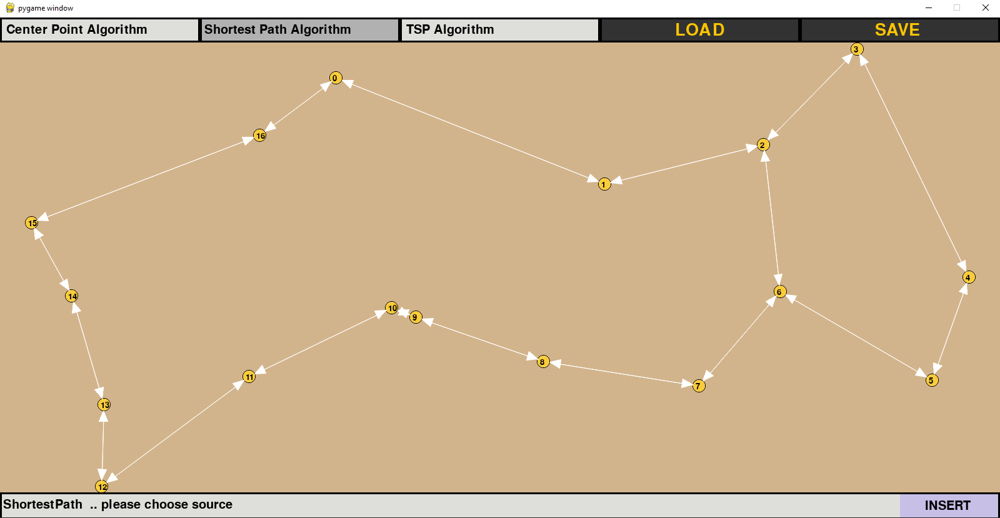
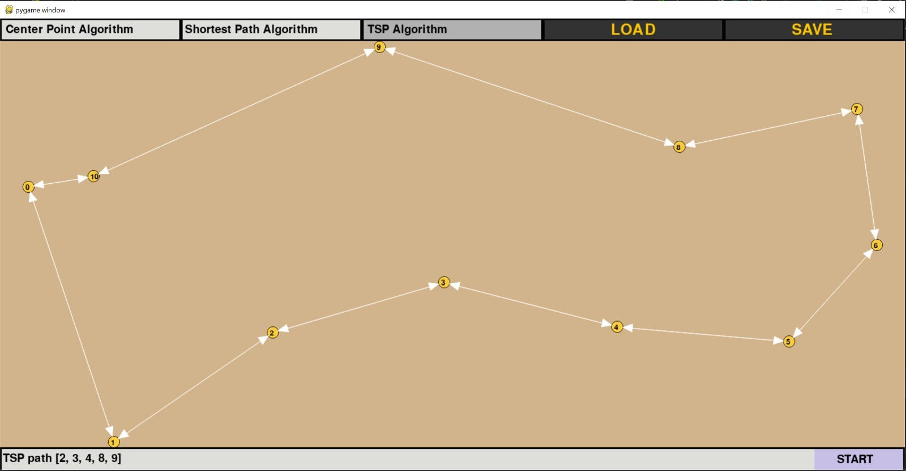
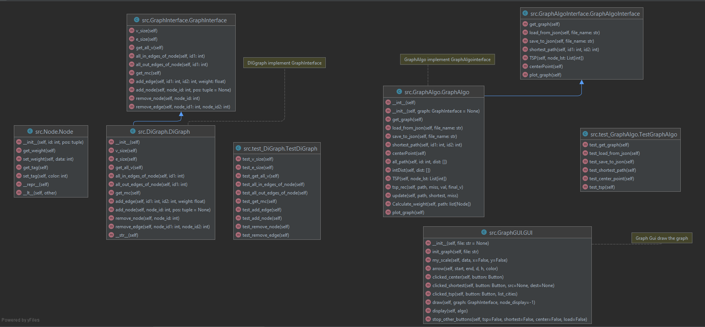

# OOP-Ex3

This project is about directed weight graph in python 

Full details in the task wiki: 

[Wiki](https://github.com/B-O-Y-group/OOP-Ex3/wiki)

#Data structure:
The data structure on which the graph is built is in a dictionary of nodes and
two dictionaries of "In edges" and "out edges" of vertexes of the graph that each edge between two vertices has weight.
(contain node src: dest -> edge weight).

[Data Structure](https://github.com/B-O-Y-group/OOP-Ex3/wiki/Data-structure)

#The Algorithm :

#shortest_path
Returns the shortest path from node id1 to node id2 using Dijkstra's Algorithm.
by going throw all the node and the edge in graph and update every node distance 
we can find the shorted path between every two node .

[Shortest Path](https://github.com/B-O-Y-group/OOP-Ex3/wiki/Algorithm#shortest-path)
        
#centerPoint
This algorithm using dijkstra and search for each node the maximum weight from him to all the other  
and then search for the minimum of all the max weight of each 
the return is the node we find .

[Center Point](https://github.com/B-O-Y-group/OOP-Ex3/wiki/Algorithm#center-point)

#TSP
This method solve the problem "Traveling Salesman Problem"
by trying all the Combinations of the faster routes for every node
in the list we can find the best of them .  

[TSP](https://github.com/B-O-Y-group/OOP-Ex3/wiki/Algorithm#tsp)

#Instructions for Gui:
click on the button "center point Algorithm"
And the red point is the center of this graph.

The Result information appears in the window at the bottom of the screen

click on the button "Shortest path Algorithm"
Then click on the screen for choosing a source node  
Then click on the screen for choosing a destination node 

The result information appears in the window at the bottom of the screen.

Click on the button "TSP Algorithm"
Then click on a vertex on the screen to create a list to find the best route  
then click on "START"

The result information appears in the window at the bottom of the screen.

click on the button "LOAD"
Then select the json file for draw the graph on the screen.

click on the button "SAVE"
Then select the folder where you want to save the graph's json file

#UML of our project 

